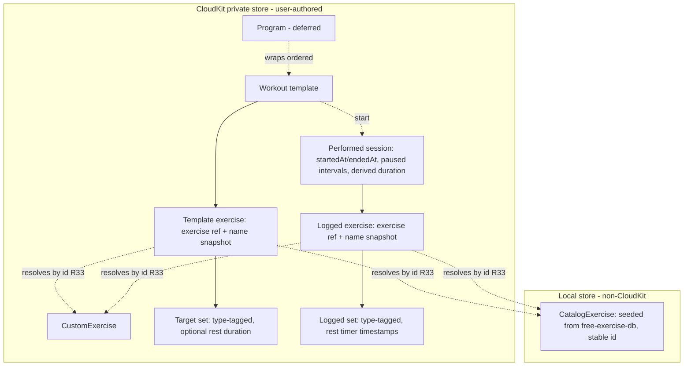

# Swole - Plan

## Goal Capsule

- **Objective:** Ship a native iOS strength-and-cardio tracking app that works fully offline and manually on any supported iPhone, with Apple Intelligence adding AI workout generation and coaching as a capability-gated bonus.
- **Product authority:** App owner (solo product decision-maker).
- **Distribution:** Paid up-front on the App Store. No in-app purchases, no paywall — every feature is included in the purchase price.
- **Open blockers:** None blocking planning. Minimum-iOS baseline and exercise-image bundling are Deferred to Planning (see Outstanding Questions).

---

## Product Contract

### Summary

Swole is a native, offline-first iOS app for tracking strength and cardio workouts. Users build and perform workouts starting from empty, from a saved template, or — on Apple Intelligence-capable devices — from a workout generated by a chat assistant that reads a summary of their history. Progressive-overload suggestions work on every device via deterministic rules; AI enriches them where available. User workout data lives on-device and, when signed in to iCloud, syncs through the private CloudKit database; the bundled exercise catalog is local to each device.

### Problem Frame

Workout trackers force a trade-off: manual loggers are reliable but dumb, while AI-driven apps depend on cloud accounts, subscriptions, and connectivity, and often break offline or leak training data to servers. An Apple-ecosystem user who trains at a gym with spotty signal wants a fast manual logger that is *also* smart — one that respects privacy, needs no subscription, and gets out of the way. Swole targets that user by making manual logging first-class and treating AI as on-device delight rather than a required, monetized dependency.

### Key Decisions

- **AI is a delight layer, not a dependency.** The app is fully usable — build, log, perform, review history, get progression suggestions — with zero AI. AI generation and coaching light up only on Apple Intelligence-capable devices (iPhone 15 Pro and the iPhone 16/17 lines, plus M-series iPads) running iOS 26+. Reaching only a device minority at launch is an accepted trade-off.
- **Single workout generation for v1, programs deferred.** AI generates one workout/template at a time, which fits comfortably within the on-device model's limited context and keeps output reliable. Multi-day programs (splits scheduled across a week/cycle) are explicitly out of v1 but the data model is shaped so a program can wrap an ordered set of templates later without migration.
- **Chat interface, schema-locked output.** Users interact with AI through free-text chat, and the model is constrained via guided generation to emit typed workout/template objects rather than prose. Guided generation guarantees shape, not correctness, so generated output is validated against the exercise catalog before use (R20).
- **History is summarized, not replayed.** AI features consume a compact rolling summary of recent training (recent lifts, PRs, volume trends) rather than raw logs, to respect the model's small context window. The summary and all inference stay on-device (R22). This summary is also useful to the app itself.
- **Progression is rule-based first.** Deterministic progressive-overload rules run on all devices instantly; AI layers richer, context-aware suggestions where available.
- **Identity is the iCloud account; no separate login.** Sync and backup use the CloudKit private database tied to the user's iCloud account. Users signed out of iCloud lose sync/backup (accepted).
- **Tech stack (subject of this brainstorm):** SwiftUI on an iOS 17+ baseline (exact minimum — 17 vs 18 — deferred to Planning); SwiftData persistence with a CloudKit private database for user-authored data and a separate local store for the bundled catalog (R23); Apple Foundation Models framework with guided generation for AI, gated behind runtime availability checks; free-exercise-db bundled as seed data. No backend service in v1.

### Actors

- A1. **User** — the single human owner of the device. Builds templates, performs workouts, reviews history, and (on capable devices) chats with the AI.
- A2. **AI assistant** — the on-device Foundation Models agent. Generates workouts/templates and offers coaching suggestions from a history summary. Present only on capable devices.
- A3. **System** — the app's rule engine and data layer: seeds exercises, computes progression suggestions, and syncs via CloudKit.

### Requirements

**Exercises**

- R1. The app ships with the free-exercise-db catalog seeded into local storage on first launch, available fully offline.
- R2. The user can create custom exercises (name plus attributes such as muscle group and equipment) when the catalog lacks one; custom exercises are usable anywhere a catalog exercise is (physical storage location is defined by R23/R33).
- R3. Each exercise supports one or more set types: weight × reps, and time / distance / pace for cardio.

**Workouts and templates**

- R4. The user can create a workout template manually: name it, add exercises, and define target sets per exercise.
- R5. The user can start a workout from empty, from a saved template, or from an AI-generated workout.
- R6. During an active workout the user can add or remove exercises, add/remove/edit sets, and edit reps/weight/time/distance per set — the running workout is fully mutable regardless of its starting point.
- R7. Completing a workout records it as a performed session with its exercises, sets, start and completion timestamps, and total duration (R30).
- R16. The active-workout lifecycle is defined: the user can cancel/discard an in-progress workout with a confirmation prompt, and an incomplete session is automatically persisted and offered for resume after the app is backgrounded, terminated, or relaunched. Resuming restores the session clock and any running rest timer (R31).
- R34. A saved template can be individually edited (rename, add/remove exercises, change target sets) and deleted, distinct from the R27 all-data reset. Editing a template does not alter previously performed sessions that were started from it.

**History**

- R8. A History tab lists previously performed workouts in reverse-chronological order, each openable to see the exercises and sets performed.
- R35. A performed session in History can be corrected by editing its logged exercises/sets and can be individually deleted, distinct from the R27 all-data reset. Edits and deletions propagate through CloudKit and are reflected in subsequent rule-based progression (R9), which reads from logged history.

**Progression**

- R9. For each exercise in a template or active workout, the system computes a rule-based progression suggestion from the user's prior performance of that exercise (e.g., increase load when the top of the target rep range was met). Suggestions are advisory, never auto-applied.
- R10. On capable devices, the AI may offer richer, context-aware progression suggestions in addition to R9's rule-based ones.
- R17. Cold-start progression: when no prior performance exists for an exercise, R9 shows no increase suggestion and instead prompts for a starting load, rather than displaying a misleading suggestion from absent data.

**AI generation (capable devices only)**

- R11. On capable devices, the user can describe a desired workout in a chat interface and receive a generated single workout/template that is added to their templates or started immediately.
- R12. AI generation considers a compact summary of the user's training history when producing a workout.
- R13. AI features are hidden or clearly unavailable on devices that cannot run Apple Intelligence; their absence never blocks any manual capability.
- R18. AI generation exposes explicit interaction states: an in-progress/generating indicator, a user-visible error state offering retry/rephrase, and defined handling for empty or invalid model output.
- R19. A generated workout is presented in the standard workout/template builder, pre-populated and fully editable, so the user can adjust exercises/sets before choosing Save as template or Start now.
- R20. Generated workouts are validated after generation: exercise references must resolve against the catalog or custom exercises, and unresolvable or implausible output is rejected/regenerated or offered to the user as a new custom exercise. Generation reliability is judged by semantic acceptance, not schema validity alone.
- R21. Cold-start generation: with empty or short history, AI generation produces a workout from the user's stated goals, equipment, and experience alone rather than failing or requiring accrued history.
- R22. AI generation and coaching run entirely on-device via Foundation Models; the history summary is never transmitted off-device; if on-device inference is unavailable, AI features are disabled rather than routed to any server or Private Cloud Compute fallback.

**Data and sync**

- R14. All user data persists on-device and is usable offline.
- R15. When signed in to iCloud, data syncs and backs up automatically through the private CloudKit database; edits made offline reconcile on reconnect.
- R23. The bundled free-exercise-db catalog is seeded into a separate, local (non-CloudKit) store that is re-seedable per device; the CloudKit-synced store holds only user-authored data (custom exercises, templates, sessions). Seeding therefore cannot produce cross-device duplicate catalog entries. Catalog entries are keyed by a stable, version-independent identifier derived from free-exercise-db's own id/slug (never array position). First-launch seeding and any app-update catalog refresh are idempotent upserts keyed on that id — adding or updating entries in place, never re-creating or reusing ids — so re-seeds and future catalog updates cannot duplicate entries or orphan the references defined in R33. A catalog entry removed in a future upstream version leaves existing references intact via their name snapshot (R33).
- R24. The app surfaces sync/backup status (syncing, synced, offline) and a distinct signed-out-of-iCloud state explaining that sync is paused; conflict-resolution behavior is defined and user-visible.
- R33. Because catalog exercises (local store) and user-authored data (CloudKit store) live in separate `ModelContainer`s that SwiftData relationships cannot span, templates and logged exercises reference an exercise by a stable, source-qualified identifier (e.g., `{source: catalog|custom, id}`) resolved at read time, not by a cross-store relationship. Catalog and custom exercises share the same reference scheme so they are interchangeable (R2). Each reference carries a denormalized exercise-name snapshot so history and templates remain readable if the referenced catalog entry later changes or is removed.
- R36. All weight and distance magnitudes are persisted in a single canonical unit — kilograms for weight, meters for distance — with conversion to the user's preferred display units (lb/kg, deferred) applied only at the presentation layer. Stored historical values are therefore never re-interpreted when the display preference changes, and progression math (R9) reads one consistent unit. (Canonical metric storage is also HealthKit-native for later integration.)
- R37. Persistence commits to a forward-evolvable baseline at v1: the SwiftData models use a versioned schema with an explicit migration plan, and the CloudKit-synced schema follows an additive-only discipline (fields are never removed or retyped once promoted to production, with a defined dev→production schema-promotion step in the release process). Future model changes are therefore migratable rather than store-breaking for shipped users.

**Navigation and app structure**

- R25. The app defines a top-level structure: a tab bar with Workouts/Templates (default landing), History, and a capability-gated AI Chat tab. The landing screen presents a start-workout entry point and the template list.

**Empty and first-launch states**

- R26. Empty and first-launch states are defined: an empty History screen guiding the user to start a first workout, an empty Templates state with a create/generate call-to-action, and a first-launch orientation to building or starting a workout.

**Privacy and data handling**

- R27. The app commits to a privacy posture: workout/history data is classified as sensitive health-adjacent data; all personal data stays on-device or in the user's private CloudKit database and is never sent to a developer-controlled server; the app provides a user-facing data-deletion/reset path with a defined effect on CloudKit; and the App Store privacy label reflects "Data Not Collected" by the developer. To keep that label accurate, diagnostics rely solely on Apple-native, user-opt-in mechanisms (MetricKit / App Store Connect crash reports); no third-party analytics, telemetry, or crash-reporting SDKs that collect data are integrated.

**Accessibility and ergonomics**

- R28. The app supports Dynamic Type and VoiceOver, meets the 44pt minimum touch-target size, and keeps primary active-workout controls reachable for one-handed use during a set.

**Timers**

- R29. Each set can have an optional rest timer with a user-set duration; when a set is completed its rest timer may start and count down. Completion signaling depends on app state:
  - **Foreground:** show the countdown and signal completion with haptic and/or sound.
  - **Backgrounded (running, not terminated):** play a short audible cue (a bell) at completion, routed to the current audio output (e.g., headphones) and honoring the device's ring/silent switch and volume.
  - **Fully closed (terminated):** no signal is delivered; on next launch the resumed session shows the timer as already elapsed (R31, AE9).
  - Skipping, ending, or editing a rest cancels or updates its pending cue. A persistent pre-scheduled local notification is deliberately not used, since no signal is wanted after full termination; the exact background-audio mechanism is deferred to Planning.
- R30. Each workout session tracks its total elapsed duration from start to completion, visible during the session and stored with the performed session (R7). The user can manually pause and resume the session timer; duration is gross wall-clock time minus any manually paused intervals. The app does not auto-pause based on inactivity or on being backgrounded/closed — a session left running (e.g., closed and resumed days later) accrues the full elapsed real-world time until completed, which is acceptable.
- R31. Rest timers and session duration are derived from persisted wall-clock timestamps, never an in-process counter that iOS suspends when the app is backgrounded or terminated. On resume mid-workout, the session clock and any running rest timer reflect true elapsed real-world time, so no time is lost while the app was closed.
- R32. A running rest timer exposes controls to skip/dismiss (end rest now and advance), pause/resume, and adjust the remaining time (e.g., ±15s). Adjusting or pausing rewrites the persisted wall-clock end timestamp (R31) rather than a counter, and updates or cancels the pending completion cue (R29).

### Key Flows

- F1. Perform a workout from a template
  - **Trigger:** A1 taps a saved template and starts it.
  - **Actors:** A1, A3
  - **Steps:** System instantiates a live workout from the template and shows rule-based progression suggestions per exercise (R9). A1 performs sets, freely editing exercises/sets mid-session (R6). A1 completes the workout.
  - **Outcome:** A performed session is recorded and appears in History (R7, R8).
  - **Covered by:** R5, R6, R7, R8, R9

- F2. Generate a workout via chat (capable device)
  - **Trigger:** A1 opens the AI chat and describes what they want.
  - **Actors:** A1, A2, A3
  - **Steps:** System supplies A2 a compact on-device history summary; A2 returns a schema-locked workout (R11, R12), shown with a generating indicator and an error/retry state on failure (R18). The result is validated against the exercise catalog (R20) and opened, pre-populated, in the editable builder (R19). A1 adjusts as needed, then saves it as a template or starts it immediately.
  - **Outcome:** A validated generated workout enters the user's templates or a live session.
  - **Covered by:** R11, R12, R18, R19, R20, R21, R22, R5

- F3. Build a workout manually from empty
  - **Trigger:** A1 starts an empty workout or a new template.
  - **Actors:** A1, A3
  - **Steps:** A1 adds exercises (catalog or custom, creating one if needed per R2), defines sets by type (R3), and performs or saves.
  - **Outcome:** A performed session or a reusable template.
  - **Covered by:** R2, R3, R4, R5, R6

### Acceptance Examples

- AE1. Progression suggestion, target met
  - **Covers R9.**
  - **Given** the user last performed an exercise hitting the top of its target rep range at a given load,
  - **When** they next open that exercise in a template or live workout,
  - **Then** the system suggests an increased load, presented as advisory (not pre-filled as performed).

- AE2. AI unavailable on incapable device
  - **Covers R13.**
  - **Given** the app runs on a device without Apple Intelligence,
  - **When** the user browses the app,
  - **Then** no AI chat/generation entry points are actionable, and every manual capability (build, log, perform, history, rule-based progression) remains fully available.

- AE3. Offline edit reconciles
  - **Covers R14, R15.**
  - **Given** the user performs a workout with no network,
  - **When** connectivity is restored while signed in to iCloud,
  - **Then** the session syncs to the private CloudKit database without data loss.

- AE4. Mid-workout mutation from a template
  - **Covers R6.**
  - **Given** a live workout started from a template,
  - **When** the user adds an unplanned exercise and changes the set count on another,
  - **Then** the changes apply to the live session and are captured in the recorded history, without altering the source template.

- AE5. Local data deletion
  - **Covers R27.**
  - **Given** the user invokes the data-deletion/reset path,
  - **When** they confirm,
  - **Then** all personal workout/history data is removed locally and the deletion propagates to the user's private CloudKit database, with no copy retained on any developer-controlled server.

- AE6. AI generation failure
  - **Covers R18.**
  - **Given** an AI generation request on a capable device,
  - **When** the model fails, times out, or returns invalid output,
  - **Then** the user sees an error state with a retry/rephrase option rather than a frozen or empty screen.

- AE7. Resume an interrupted workout
  - **Covers R16.**
  - **Given** an in-progress workout with logged sets,
  - **When** the app is terminated and relaunched,
  - **Then** the incomplete session is preserved and the user is offered to resume it.

- AE8. Multi-device catalog has no duplicates
  - **Covers R23.**
  - **Given** the user installs the app on a second device signed in to the same iCloud account,
  - **When** the second device seeds its local catalog and syncs user data,
  - **Then** the exercise catalog shows no duplicated entries and custom exercises/templates/sessions sync without conflict.

- AE9. Timers continue while the app is closed
  - **Covers R31, R16, R30.**
  - **Given** an in-progress workout with a running rest timer and a session that started 20 minutes ago,
  - **When** the user fully closes the app for 3 minutes and reopens it,
  - **Then** the workout resumes, the session duration reads ~23 minutes, and the rest timer reflects the real elapsed time (finished, or 3 fewer minutes remaining) rather than having paused while closed.

### Data Model (shape)

The entity shape below is load-bearing for the "programs later" decision — a `Program` wraps ordered templates without reshaping existing entities. Exercises live in two stores (R23): `CatalogExercise` in the local store and `CustomExercise` in the CloudKit store. Templates/logged exercises do not relate to them directly; they hold a stable source-qualified exercise reference resolved at read time (R33), shown as dotted edges.

### Scope Boundaries

**Deferred for later**

- Apple Watch companion app (log sets, rest timers, heart rate on the wrist).
- HealthKit integration (write workouts to Apple Health; read bodyweight/HR).
- Multi-day programs / splits with scheduling across a week or cycle.

**Outside this product's identity**

- Cloud-LLM fallback for non-capable devices — rejected to stay all-Apple and offline-first.
- Social features: sharing, feeds, leaderboards, following.
- Subscriptions or in-app purchases — the product is a one-time paid app.

### Dependencies / Assumptions

- Apple Foundation Models framework (iOS 26+) is available and its guided-generation output is reliable enough to fill a typed single-workout schema, where "reliable enough" means semantic acceptance (valid, catalog-resolvable exercises), not schema validity alone; unresolvable output is rejected/regenerated (R20). AI features are gated behind runtime availability checks and degrade to hidden on failure.
- free-exercise-db's license (public-domain / Unlicense) permits bundling and redistribution in a paid App Store app. Assumed true; verify the exact license terms and any attribution expectation during planning. No fallback catalog source is named if verification fails.
- SwiftData + CloudKit private-database sync meets offline-first needs within its known constraints (e.g., relationship/uniqueness limitations). The bundled catalog is kept in a separate local store to avoid CloudKit's lack of unique constraints (R23). Core Data + CloudKit is the fallback if those constraints prove blocking.

### Outstanding Questions

**Deferred to Planning**

- Minimum iOS baseline for the manual app (17 vs 18), independent of the iOS 26 AI gate.
- Whether to bundle exercise images/animations from free-exercise-db (app size and licensing/attribution implications) or ship text-only at launch.
- Units handling (lb/kg) and where the preference lives (per-user default, per-exercise override).
- Bodyweight tracking — likely in-scope for a complete v1; confirm during planning. (Rest timers are now in scope — see R29–R31.)
- Rest-timer details deferred to Planning: per-set vs per-exercise default duration, auto-start-on-set-completion behavior, and the exact background-audio mechanism for the backgrounded completion cue including how it honors the silent switch (R29). Resolved: no signal is delivered after full app termination.
- Exact rule-based progression policy (rep-range thresholds, increment sizes, per-set-type behavior).
- Data export/portability: decide in-or-out for v1. iCloud is currently the sole durability path (signed-out users lose sync/backup, accepted), so a permanently signed-out user has no route to recover or move their history; if export is in, reserve a serializable representation now.
- Whether the deferred Watch/HealthKit features need any early schema accommodation beyond the canonical-metric units decision (R36) and HealthKit-mappable workout/exercise typing — likely none given the reserved entity shape; confirm.
- Conflict-resolution strategy backing R24 (last-writer-wins vs field-merge, and whether sessions are treated as append-only), which constrains what resolution is achievable.
- Swift 6 strict-concurrency ownership of SwiftData/cross-store reads (main-actor vs a dedicated `ModelActor`).
- Data-model details: model the session's paused intervals (R30) as explicit (start, end) pairs, and define which `LoggedSet`'s rest-timer timestamps represent the single active rest timer restored on resume (R31).
